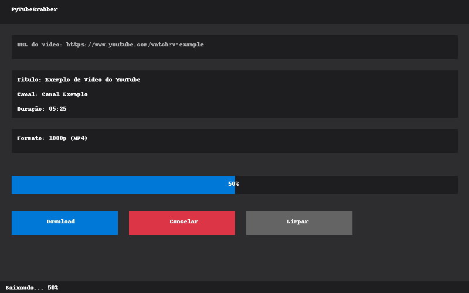

# PyTubeGrabber

<div align="center">


[](https://www.python.org/)
[](https://www.riverbankcomputing.com/software/pyqt/)
[](https://github.com/yt-dlp/yt-dlp)
[](LICENSE)
[](https://github.com/StefanoGysin/PyTubeGrabber)

**Aplicativo para download de vídeos do YouTube em formatos MP3 e MP4 com interface gráfica amigável.**

</div>

## 📑 Índice

- [Descrição](#-descrição)
- [Recursos](#-recursos)
- [Pré-requisitos](#-pré-requisitos)
- [Instalação](#-instalação)
- [Uso](#-uso)
- [Estrutura do Projeto](#-estrutura-do-projeto)
- [Roadmap](#-roadmap)
- [Contribuição](#-contribuição)
- [Licença](#-licença)
- [Créditos](#-créditos)

## 📝 Descrição

PyTubeGrabber é um aplicativo de desktop desenvolvido em Python para facilitar o download de vídeos do YouTube em formatos MP3 (áudio) e MP4 (vídeo). Oferece uma interface gráfica intuitiva e amigável, permitindo selecionar diferentes qualidades de vídeo e baixar múltiplos arquivos com facilidade.



## ✨ Recursos

- Interface gráfica moderna e amigável
- Download de vídeos em formato MP4 com várias qualidades (até 1080p)
- Extração de áudio em formato MP3
- Exibição de informações detalhadas sobre o vídeo antes do download
- Barra de progresso em tempo real
- Suporte a temas claro e escuro
- Capacidade de linha de comando para automação
- Compatível com Windows, macOS e Linux

## 📋 Pré-requisitos

- Python 3.6 ou superior
- pip (gerenciador de pacotes Python)
- FFmpeg (para conversão de áudio) - opcional, mas recomendado

## 🚀 Instalação

### Instalação rápida

Para iniciar rapidamente com o projeto clonado:

```bash
# Clone o repositório
git clone https://github.com/StefanoGysin/PyTubeGrabber.git
cd PyTubeGrabber

# Configure um ambiente virtual
python -m venv .venv

# Ative o ambiente virtual
# No Windows:
.venv\Scripts\activate
# No Linux/macOS:
source .venv/bin/activate

# Instale as dependências
pip install -r requirements.txt

# Execute o aplicativo
python main.py
```

### Instalação como pacote

Para instalar o PyTubeGrabber como um pacote:

```bash
# Instale diretamente do GitHub
pip install git+https://github.com/StefanoGysin/PyTubeGrabber.git

# Ou instale localmente após clonar
git clone https://github.com/StefanoGysin/PyTubeGrabber.git
cd PyTubeGrabber
pip install -e .
```

### Configuração do FFmpeg

Para habilitar a funcionalidade de conversão para MP3, é necessário instalar o FFmpeg:

**Windows:**
1. Baixe o FFmpeg do [site oficial](https://ffmpeg.org/download.html) (versão "full static")
2. Extraia o conteúdo em uma pasta (exemplo: C:\ffmpeg)
3. Adicione a pasta bin do FFmpeg (exemplo: C:\ffmpeg\bin) ao PATH do sistema ou
4. Configure o caminho no aplicativo através de Menu > Arquivo > Configurar FFmpeg

**Linux:**
```bash
sudo apt update
sudo apt install ffmpeg
```

**macOS:**
```bash
brew install ffmpeg
```

## 🎮 Uso

### Execução Direta

Após a instalação, você pode executar o aplicativo de várias formas:

```bash
# A partir da raiz do projeto
python main.py

# Como módulo Python
python -m pytubegrabber

# Usando o ponto de entrada instalado (se instalado com pip)
pytubegrabber
```

### Interface Gráfica

1. **Cole a URL do vídeo** do YouTube no campo de entrada
2. Clique em **Analisar URL** para carregar informações do vídeo
3. Selecione o **formato** (MP3 ou MP4) e a **qualidade** desejada
4. Escolha o **diretório de destino** clicando em "Procurar..."
5. Clique em **Download** para iniciar o processo
6. Para download em lote, use a opção **Download em Lote** no menu

### Linha de Comando

O PyTubeGrabber também pode ser usado via linha de comando:

```bash
python -m pytubegrabber --url "https://www.youtube.com/watch?v=dQw4w9WgXcQ" --format mp4 --quality high
```

Opções disponíveis:

- `--url`: URL do vídeo do YouTube
- `--dir`: Diretório de saída para o arquivo baixado
- `--format`: Formato de saída (`mp3` ou `mp4`)
- `--quality`: Qualidade do vídeo (`best`, `high`, `medium`, `low`)
- `--version`: Exibe a versão do aplicativo

## 📂 Estrutura do Projeto

```
PyTubeGrabber/
├── main.py                   # Ponto de entrada principal
├── pytubegrabber/            # Pacote principal
│   ├── __init__.py           # Inicialização do pacote
│   ├── __main__.py           # Ponto de entrada do programa como módulo
│   ├── core/                 # Funcionalidades principais
│   │   ├── __init__.py
│   │   └── downloader.py     # Lógica de download de vídeos
│   ├── gui/                  # Interface gráfica
│   │   ├── __init__.py
│   │   └── main_window.py    # Janela principal da aplicação
│   └── utils/                # Utilitários
│       ├── __init__.py
│       └── config.py         # Gerenciamento de configurações
├── docs/                     # Documentação
├── tests/                    # Testes unitários
├── LICENSE                   # Licença do projeto
├── README.md                 # Este arquivo
├── requirements.txt          # Dependências do projeto
└── setup.py                  # Script de instalação
```

## 🔮 Roadmap

Recursos planejados para futuras versões:

- [ ] Integração com outras plataformas (Vimeo, Facebook, etc.)
- [ ] Download de playlists e canais completos
- [ ] Interface em múltiplos idiomas
- [ ] Conversão para formatos adicionais (MKV, AVI, etc.)
- [ ] Agendamento de downloads
- [ ] Versão para celular (Android/iOS)
- [ ] Suporte para download de legendas
- [ ] Edição básica de arquivos baixados (cortar, unir, etc.)

## 👥 Contribuição

Contribuições são bem-vindas! Se você deseja contribuir com o projeto, siga estas etapas:

1. Faça um fork do repositório
2. Crie uma branch para sua feature (`git checkout -b feature/nova-feature`)
3. Faça commit de suas alterações (`git commit -am 'Adiciona nova feature'`)
4. Faça push para a branch (`git push origin feature/nova-feature`)
5. Abra um Pull Request

### Diretrizes de Contribuição

- Mantenha o código limpo e bem documentado
- Adicione testes para novas funcionalidades
- Atualize a documentação quando necessário
- Siga o estilo de código existente (PEP 8)

## 📄 Licença

Este projeto está licenciado sob a Licença MIT - veja o arquivo [LICENSE](LICENSE) para detalhes.

## 🙏 Créditos

- [yt-dlp](https://github.com/yt-dlp/yt-dlp) - Biblioteca para download de vídeos
- [PyQt5](https://www.riverbankcomputing.com/software/pyqt/) - Framework para interface gráfica
- [FFmpeg](https://ffmpeg.org/) - Conversão de áudio/vídeo

## 📧 Contato

Stefano Gysin - [@stefanogysin](https://github.com/StefanoGysin)

Link do Projeto: [https://github.com/StefanoGysin/PyTubeGrabber](https://github.com/StefanoGysin/PyTubeGrabber)

---

<div align="center">
  Desenvolvido com ❤️ pela comunidade PyTubeGrabber
</div> 